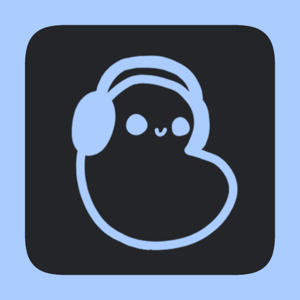
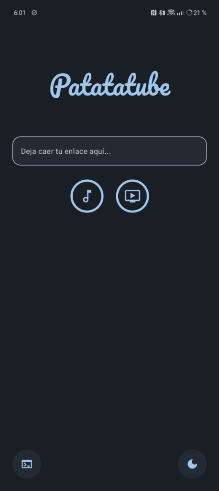
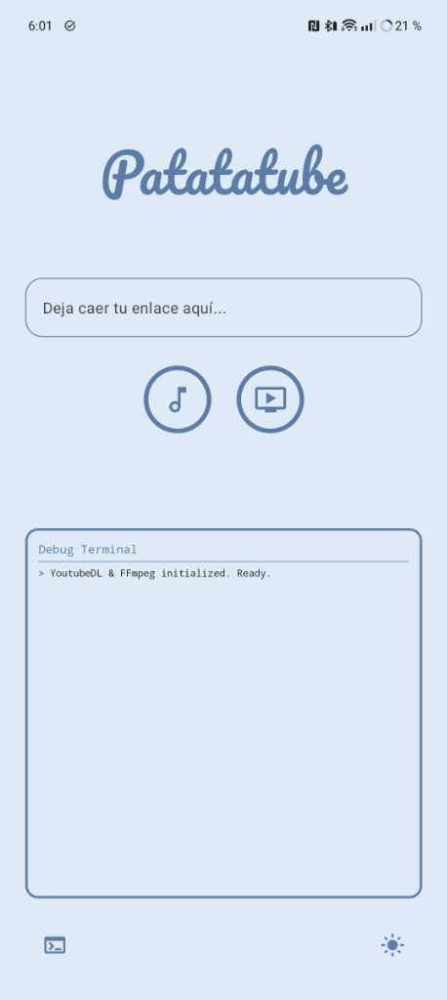
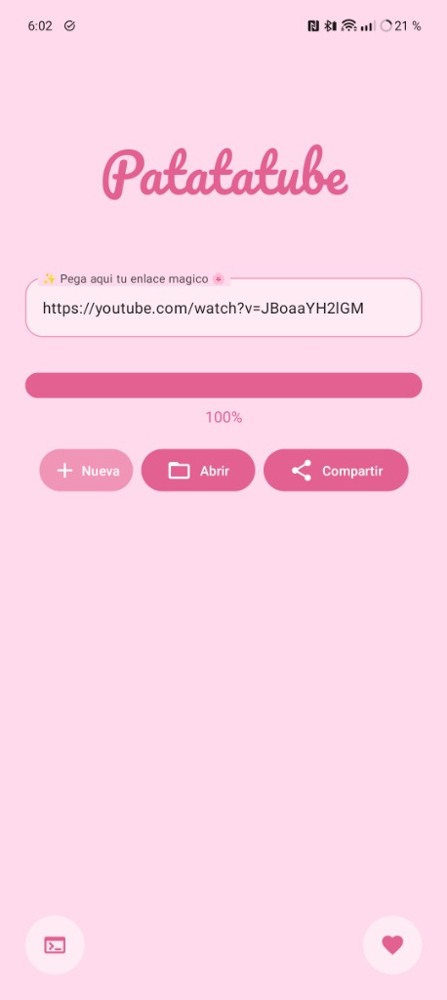

<div align="center">
  
  <h1>🥔 Patatatube Android 🎧</h1>
  <p><b>¡Descarga cualquier vídeo o audio de tus plataformas favoritas con estilo!</b></p>
  <p>   </p>
</div>

---

## ✨ Características

- 🎥 **Descargas Multidispositivo:** Basado en el potente motor de `yt-dlp`, soportando YouTube, TikTok, Twitter, y cientos de plataformas más.
- 🎵 **Formatos Flexibles:** Descarga en MP4 (Mejor calidad de Vídeo) o MP3 (Audio).
- 🎨 **Interfaz Moderna:** Diseño fluido y dinámico construido 100% en Jetpack Compose con animaciones y Ripple effects.
- 🌸 **Temas Personalizados:** Cambia entre el modo Oscuro elegante y el tema ultra-kawaii *Poke*.
- 🖥️ **Terminal Integrada:** ¡Monitoriza lo que pasa bajo el capó! Una consola embebida que te muestra el log en tiempo real de `yt-dlp`.
- ⚡ **Descargas en Segundo Plano:** Foreground Service implementado para que tus descargas no se corten al minimizar la app.
- 🚀 **Actualizaciones In-App:** Easter Egg exclusivo para actualizar los binarios de `yt-dlp` directamente desde la app.
- 🔗 **Compartir Directo:** ¡No hace falta copiar y pegar! Usa el botón "Compartir" en YouTube, TikTok o cualquier app y selecciona Patatatube para enviar el enlace mágicamente.

## 📸 Capturas de Pantalla

<p align="center">
  
  
  
</p>

## 🛠️ Tecnologías Utilizadas

- **Lenguaje:** Kotlin
- **UI:** Jetpack Compose (Material Design 3)
- **Asincronía:** Coroutines & StateFlow
- **Motor de Descarga:** [youtubedl-android](https://github.com/yausername/youtubedl-android) (Wrapper de `yt-dlp` para Android)
- **Arquitectura:** Patrón Singleton para el Estado + Foreground Services.

## 🚀 Instalación y Compilación

### Requisitos Previos
- Android Studio (Versión Iguana o superior recomendada)
- JDK 17 o superior.

### Pasos

1. Clona este repositorio:
   ```bash
   git clone https://github.com/tu-usuario/patatatube-android.git
   ```
2. Abre el proyecto en Android Studio.
3. Conecta tu dispositivo Android (físico o emulador).
4. Dale al botón de **Run** (`Shift + F10`) o compila desde la terminal:
   ```bash
   ./gradlew assembleDebug
   ```

## 🤫 Easter Eggs

¡Patatatube tiene secretos escondidos!
- **Actualizar yt-dlp:** Mantén pulsado el botón de la Terminal (`>_`) durante medio segundo para forzar una actualización del motor de descargas en segundo plano.
- **Créditos:** Mantén pulsado el botón de Temas (🎨) para ver quiénes son las mentes creativas detrás del diseño y la programación.

---
<div align="center">
  <i>Diseñado por <b>pokeinalover</b> | Programado con ❤️ por <b>ContratopDev</b></i>
</div>
