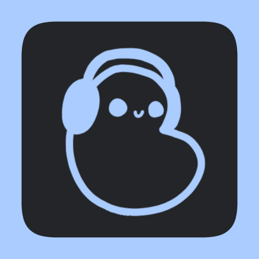
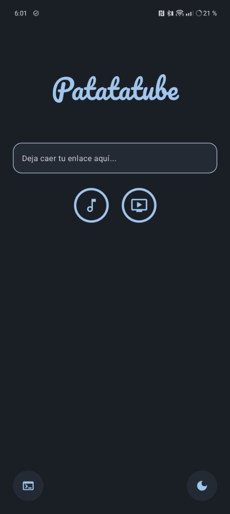
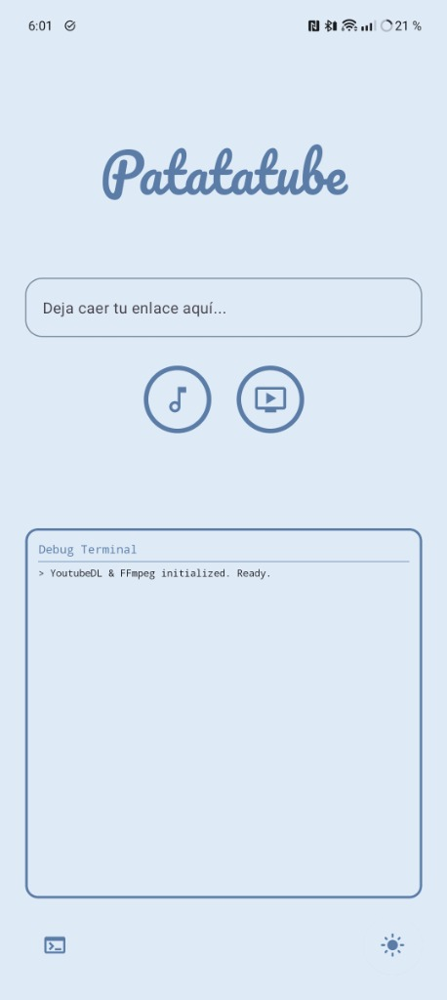
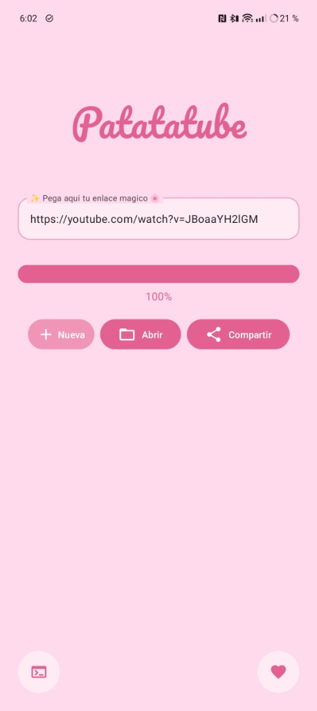

<div align="center">
  
  
  # 🥔 Patatatube Android 🎧
  
  **El descargador multimedia definitivo para Android: potente, libre, inmune a los bloqueos de YouTube y con un estilazo único.**

  [](https://github.com/contratop/Patatatube-Android/releases/latest)
  [](https://github.com/contratop/Patatatube-Android/actions)
  [](https://android.com)
  [](https://kotlinlang.org)
  [](https://developer.android.com/jetpack/compose)
  [](https://github.com/yt-dlp/yt-dlp)
  [](LICENSE)

  <br/>
  
  [📥 **Descargar Último APK (v1.2.0)**](https://github.com/contratop/Patatatube-Android/releases/latest) • [✨ Novedades](#-novedades-destacadas-v120) • [📸 Capturas](#-capturas-de-pantalla) • [🛠️ Compilación](#️-compilación-local)
</div>

---

## ⚡ Novedades Destacadas (v1.2.0)

- 🛡️ **Bypass de YouTube SABR & Fix 403 Forbidden:** Implementación del cliente `visionos` en `yt-dlp` que neutraliza las recientes restricciones de streaming y comprobaciones de integridad de Google sin requerir JavaScript externo.
- 📦 **Motor Nightly de Serie:** Empaquetado interno de la versión más reciente de `yt-dlp`, con auto-extracción automática al actualizar la app para no depender de descargas externas iniciales.
- 🔄 **Actualizador del Motor con Canal NIGHTLY:** Mantén pulsado el botón de terminal para actualizar el binario al instante desde el canal Nightly oficial de `yt-dlp` (o Stable como respaldo).
- 🎬 **Muxing Universal con FFmpeg:** Descarga automáticamente los mejores streams independientes de vídeo y audio y los ensambla limpiamente en un contenedor `.mp4`.

---

## ✨ Características Principales

### 🚀 Descargas Potentes y Fiables
* **Descarga de Vídeo:** Obtén la mejor calidad disponible (1080p, 2K, 4K) combinando pistas de vídeo y audio de alta fidelidad.
* **Descarga de Audio MP3/M4A:** Extrae el audio con un solo toque, incrustando automáticamente metadatos (título, artista, álbum) y la miniatura original como carátula de disco.
* **Segundo Plano Real:** Olvídate de quedarte con la app abierta. Patatatube utiliza *Foreground Services* nativos de Android con notificación persistente para que tus descargas sigan vivas aunque bloquees la pantalla o cambies de app.

### 🎨 Diseño y Experiencia de Usuario
* **100% Jetpack Compose & Material 3:** Animaciones fluidas, controles táctiles cuidados y diseño moderno y limpio.
* **Paletas de Temas:**
  * 🌙 **Dark Mode:** Elegante y perfecto para pantallas AMOLED.
  * ☀️ **Light Mode:** Claro, fresco y legible bajo la luz del día.
  * 🌸 **Poke Theme:** Vibrante paleta rosa/lila con personalidad propia.
* **Integración con el Sistema:** Envía enlaces directamente desde la app de YouTube, TikTok, Twitter/X o cualquier navegador pulsando el botón **Compartir** en tu móvil.
* **Terminal Hacker Integrada:** Botón flotante para inspeccionar en tiempo real los logs y la salida estándar de `yt-dlp` y `ffmpeg`.

---

## 📸 Capturas de Pantalla

<div align="center">
  
  &nbsp;&nbsp;
  
  &nbsp;&nbsp;
  
</div>

---

## 🛠️ Tecnologías y Arquitectura

* **Lenguaje:** Kotlin 2.0+
* **Framework UI:** Jetpack Compose + Material 3
* **Concurrencia:** Kotlin Coroutines & StateFlow reactivo
* **Motor Multimedia:** [youtubedl-android](https://github.com/yausername/youtubedl-android) con binario optimizado `yt-dlp Nightly`
* **Transcodificación:** FFmpeg integrado para multiplexación de contenedores y etiquetado ID3/MP4
* **Servicios del Sistema:** Android Foreground Services con canales de notificación dedicados

---

## 🚀 Instalación y Uso

### Descargar la Aplicación
1. Ve a la sección de [Releases de GitHub](https://github.com/contratop/Patatatube-Android/releases/latest).
2. Descarga el archivo `Patatatube-v1.2.0.apk`.
3. Abre el archivo en tu dispositivo e instálalo (permite la instalación de fuentes desconocidas si tu navegador te lo solicita).

---

## 💻 Compilación Local

### Requisitos
* **Android Studio:** Ladybug / Iguana o superior.
* **JDK:** Java 17 (Temurin o OpenJDK).
* **Android SDK:** API 24 (mínimo) a API 34.

### Pasos
```bash
# 1. Clona el repositorio
git clone https://github.com/contratop/Patatatube-Android.git
cd Patatatube-Android

# 2. Compila la versión Debug
./gradlew assembleDebug

# El APK resultante se encontrará en:
# app/build/outputs/apk/debug/app-debug.apk
```

---

## 🤫 Secretos y Easter Eggs

Patatatube incluye atajos ocultos para usuarios avanzados:
* ⚡ **Forzar Actualización de yt-dlp:** Mantén presionado el botón flotante de la Terminal (`>_`) durante medio segundo para forzar una sincronización y actualización inmediata del motor contra el canal Nightly.
* 🎨 **Créditos del Proyecto:** Mantén pulsado el botón de la paleta de Temas (`🎨`) para abrir el modal secreto con los reconocimientos del equipo.

---

## 📄 Licencia

Este proyecto se distribuye bajo la licencia **GNU General Public License v3.0 (GPLv3)**.  
El código es y será siempre libre y de código abierto. Eres bienvenido a estudiarlo, modificarlo y redistribuirlo respetando los términos de la GPLv3.

---

<div align="center">
  <i>Diseñado con pasión por <b>pokeinalover</b> • Programado con ❤️ por <b>ContratopDev</b></i>
</div>
